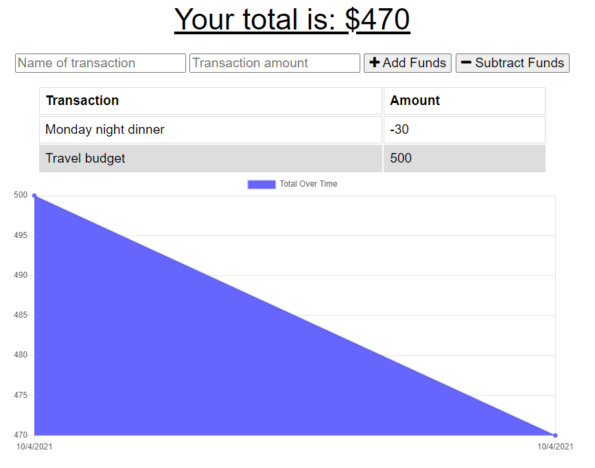

# Online/Offline Budget Tracker

Link to the deployed application: https://raven-budget-tracker.herokuapp.com/

Link to the code repository: https://github.com/raven-bootcamp/budget-tracker

## Table of Contents
- [The Task](#the-task)
- [Features](#features)
- [Instructions for Use](#instructions-for-use)
- [Technologies Used](#technologies-used)
- [User Story](#user-story)
- [Business Context](#business-context)
- [Acceptance Criteria](#acceptance-criteria)
- [Screenshots](#screenshots)

## The Task
We have been given an existing Budget Tracker application, and the task is to allow the application to be used offline and updated once an online connection is resumed.

The user is able to add expenses and deposits to their budget with or without an internet connection. When entering transactions offline, the total is populated when the application is brought back online.

### Features
- Enter deposits offline
- Enter expenses offline
Once online again:
- offline entries uploaded and synced

## Instructions for Use
Assuming you have MongoDB installed on your local machine already:

```shell
# install npm libraries
npm install

# in a terminal window, run mongo DB server
mongod

# in a separate terminal window, run the application
nmp start
```
## Technologies Used
- [Node.js](https://nodejs.org/en/)
- **NPM libraries and frameworks**:
    + [Express](https://www.npmjs.com/package/express) : framework for routing 
    + [Mongoose](https://www.npmjs.com/package/mongoose) : object modeling tool for MongoDB
    + [Morgan](https://www.npmjs.com/package/morgan) : HTTP request logger middleware
    + [Dotenv](https://www.npmjs.com/package/dotenv) : for the use of environment variables
    + [Compression](https://www.npmjs.com/package/compression) : for compression middleware

## User Story
```gherkin
AS AN avid traveller
I WANT to be able to track my withdrawals and deposits with or without a data/internet connection
SO THAT my account balance is accurate when I am traveling
```

## Business Context
Giving users a fast and easy way to track their money is important, but allowing them to access that information anytime is even more important. Having offline functionality is paramount to our applications success.

## Acceptance Criteria
```gherkin
GIVEN a user is on Budget App without an internet connection
WHEN the user inputs a withdrawal or deposit
THEN that will be shown on the page, and added to their transaction history when their connection is back online.
```
## Screenshots

